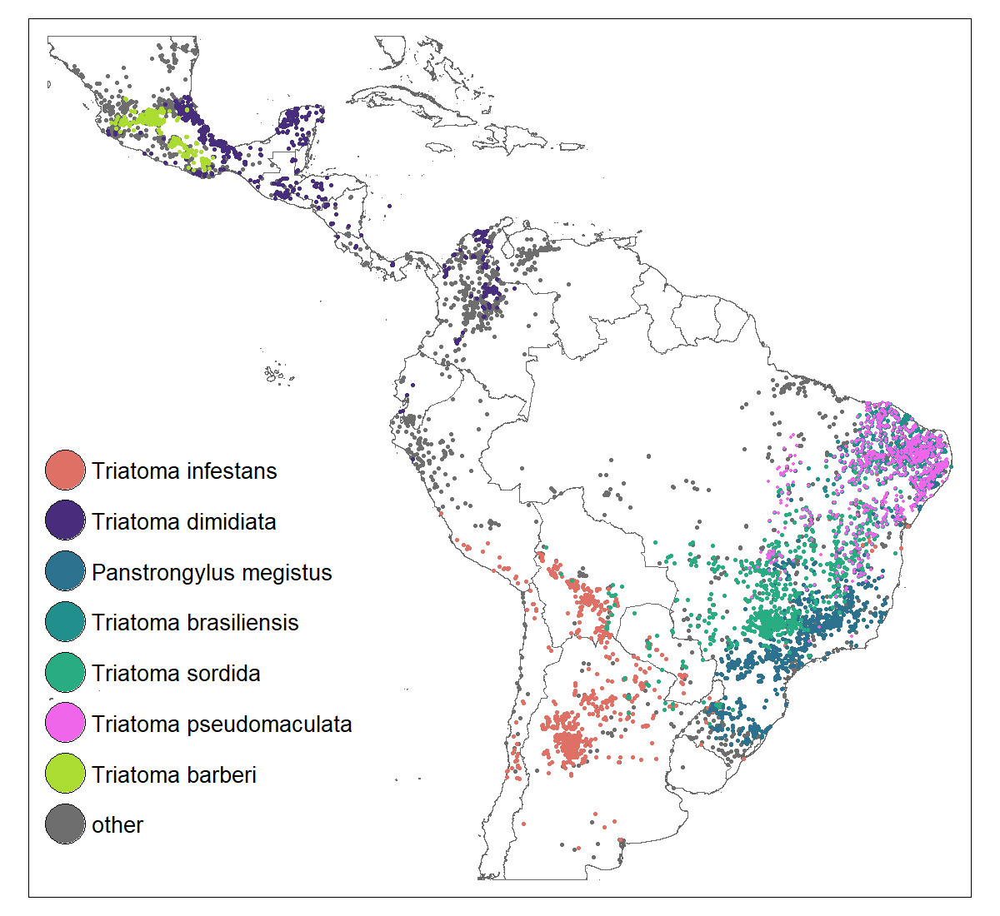
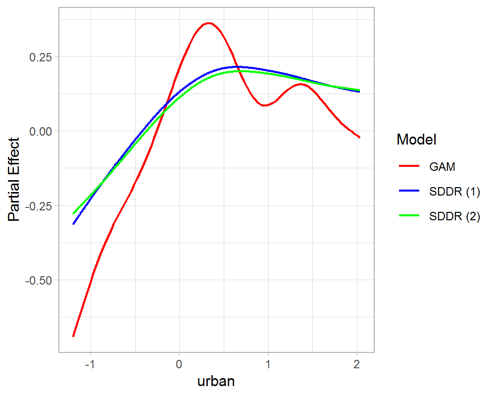
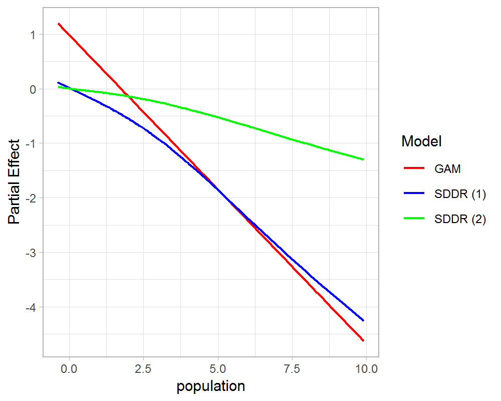
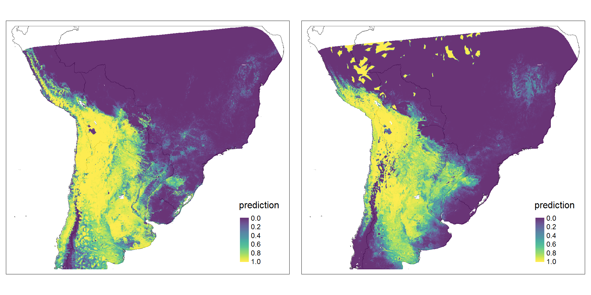
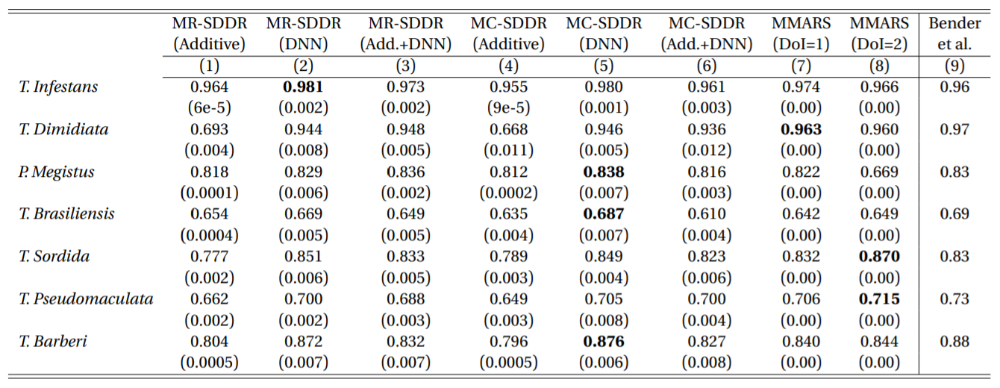

# Species Distribution Modeling of vector species for <em>American Trypanosomiasis</em> using Semi-Structured Deep Distributional Regression

This repository contains code and data for the analysis of multiple <em>triatomine</em> species in South and Middle America that act as vector species for the parasitic protozoan <em>Trypanosoma cruzi</em>, a pathogen responsible for one of the most burdensome neglected tropical diseases, <em>American Trypanosomiasis</em> or Chagas disease. 

## This is the Data

The following table describes the constitution of the seven single-species data sets, showing 7,541 unique presence locations of one of the seven modeled species. Due to the target-group background approach, the absences of a species are drawn from the presence location of other species, preferably with similar sampling intensity. There are 3,759 "true" pseudo-absences in the data, i.e. presence locations of an unmodeled species. In total, the data contains 11,300 unique observations. Because presence points of a modeled species can also appear as pseudo-absences in other species data sets, duplicates inflate the total number of instances over all single-species data sets to 30,460. 

<center>

 **Single-Species Datasets** | **presence points** | **pseudo-absences** | **Sum** 
-----------------------------|---------------------|---------------------|---------
 T. Infestans                | 2,499               | 4,458               | 6,957   
 T. Dimidiata                | 1,186               | 2,883               | 4,069   
 P. Megistus                 | 968                 | 3,409               | 4,377   
 T. Brasiliensis             | 820                 | 1,989               | 2,809   
 T. Sordida                  | 809                 | 4,919               | 5,728   
 T. Pseudomaculata           | 804                 | 3,100               | 3,904   
 T. Barberi                  | 455                 | 2,161               | 2,616   
 Sum                         | 7,541               | 22,919              | 30,460  
 
 </center>
 
 The following map illustrates the geographical distribution of triatomine vector species occurences, colored by species:
 
<p align="left">
 
</p>


\
**Disclaimer 1**: The analysis requires deprecated versions of the **`R`** package **`deepregression`**, which are supplied in the folders named "repo". Note that the repo/code requires **`python`** (3.7.10), **`tensorflow`** (2.0.0) and **`tensorflow_probability`** (0.8.0) installed in a conda environment named **`r-reticulate`**, as well as various **`R`** dependencies. See the README files in the `deepregression-master` folder within `repo` for details on the **`R`** dependencies. Further note that the single-species models use another version of `deepregression` than the pooled and multi-species models (hence syntax might differ). Figuring out the right set-up and dependencies to run the code can be tedious.

**Disclaimer 2**: The analysis is not entirely reproducible using only the data and code in this repo, as it relies on some large data could not be included here. Scripts that cannot be run are **`plots-single-species.R`** for the single-species predictive distribution maps (pre-computed plots are included in `single-species-models/plot-results/sdm-plots`) and **`full-model-datagen.R`** (pre-processes data set `full-model-list.Rds` is contained in `pooled-models/data` and `multi-species-models/data`). Both scripts require the raw environmental grid data (too big) and will thus not be partly computable. 

# Folder structure
Overview of project files and folders:

## single-species-models

This folder contains the necessary code for the single-species SDDR models, plots, as well as the comparison benchmarks. Nested folders contain the necessary `deepregression` repo, the single-species data sets, the pre-computed Bayesian Optimization hyperparameters, auxiliary scripts for data pre-processing and the model formulas, as well as the pre-computed output of the scripts following below.

- **`performance-results-single-species.R`**  (runtime: **some hours** on LEQR server)

This script takes the optimized hyperparameters in the `ParBayesianOptimization` objects from the folder `bayesian-optimization` and trains SDDR models for each species and predictor type ten times using random weight initializations to produce the final AUC and Brier performance results. Output is in folder `performance-results`.

- **`benchmarks-single.R`** (runtime: **some minutes** on LEQR server)

This script produces the univariate benchmark results (`mgcv` GAM, XGBoost and MaxEnt). Combining the output of both R scripts **`performance-results-single-species.R`** and **`benchmarks-single.R`** yields the following table:

| **Single-Species**<br>**Test AUC** | **SDDR<br>(Add only)** | **SDDR<br>(DNN only)** | **SDDR<br>(Addit+DNN)** | **GAM**<br>(mgcv) | **XGBoost** | **MaxEnt**<br>(maxnet) | **Bender et al.** |
|:----------------------------------:|:----------------------:|:----------------------:|:-----------------------:|:-----------------:|:-----------:|:----------------------:|:-----------------:|
|                                    |           (1)          |           (2)          |           (3)           |        (4)        |     (5)     |           (6)          |        (7)        |
| T. Infestans                       |          0.965         |        **0.977**       |          0.976          |       0.970       |    0.973    |          0.973         |        0.96       |
|                                    |         (1 e-6)        |         (3 e-3)        |         (2 e-3)         |       (0.00)      |    (0.00)   |         (0.00)         |                   |
| T. Dimidiata                       |          0.925         |          0.960         |          0.962          |       0.963       |  **0.965**  |          0.946         |        0.97       |
|                                    |         (3 e-3)        |         (2 e-3)        |         (1 e-3)         |       (0.00)      |    (0.00)   |         (0.00)         |                   |
| P. Megistus                        |          0.819         |          0.828         |        **0.830**        |       0.827       |    0.828    |          0.821         |        0.83       |
|                                    |         (1 e-4)        |         (2 e-3)        |         (2 e-3)         |       (0.00)      |    (0.00)   |         (0.00)         |                   |
| T. Brasiliensis                    |          0.674         |          0.690         |          0.682          |     **0.694**     |    0.640    |          0.666         |        0.69       |
|                                    |         (1 e-4)        |         (5 e-3)        |         (8 e-3)         |       (0.00)      |    (0.00)   |         (0.00)         |                   |
| T. Sordida                         |          0.827         |          0.838         |          0.830          |       0.826       |  **0.848**  |          0.803         |        0.83       |
|                                    |         (2 e-3)        |         (5 e-3)        |         (7 e-3)         |       (0.00)      |    (0.00)   |         (0.00)         |                   |
| T. Pseud.                          |          0.692         |          0.724         |          0.709          |       0.725       |    0.716    |        **0.741**       |        0.73       |
|                                    |         (3 e-3)        |         (4 e-3)        |         (1 e-2)         |       (0.00)      |    (0.00)   |         (0.00)         |                   |
| T. Barberi                         |          0.867         |          0.862         |          0.867          |     **0.873**     |    0.870    |          0.858         |        0.88       |
|                                    |         (5 e-4)        |         (7 e-3)        |         (1 e-2)         |       (0.00)      |    (0.00)   |         (0.00)         |                   |

- **`effect-curves-single-species.R`** (runtime: **some hours** on LEQR server)

This script produces the partial effect curves of the optimized models for the species <em>Panstrongylus megistus</em> (another species can simply be specified at the beginning). The plots show three models: The output can be found in folder `single-species-models/plot-results/partial-effects`.

<p float="center">
  
   
</p>

The figure above displays the learned effect curves for a `mgcv`GAM, an SDDR model (1) with only structured smooth effect terms, and an SDDR model (2) with both structured and and a DNN effect. The data set is the single-species data set for the vector species *Panstrongylus megistus*.

- **`plots-single-species.R`** (runtime: **several hours** on LEQR server)

This script produces the predictive distribution maps for the modeled vector species obtained by SDDR (DNN-only predictor type). This **script cannot be run** without the environmental grid data not included here. Output of the script can be found in `single-species-models/plot-results/sdm-plots`.



The figure above shows predictive distribution maps for the vector species *Triatoma infestans* obtained through SDDR (left) or an `mgcv` GAM (right).

- [**`bayes-hopt-single.R`** (runtime: **2-3 weeks** on LEQR server)]

This script performs Bayesian Hyperparameter Optimization using Gaussian processes as a surrogate model for all 7 species and 3 predictor types in the single-species setting. Subsequently, the optimized model is randomly initialized and trained ten times (for each species x predictor combination) to produce the final averaged performance results **(runs for 7+ days!)**. Note that the hyperparameter ranges in this script are more general than the bounds used for the single-species models in the thesis, e.g., allowing for more than one hidden layer. **Results will thus differ**. 

To re-run the thesis single-species AUC and Brier results with the pre-computed `ParBayesianOptimization` objects (same as results in thesis), you need to run **`performance-results-single-species.R`**. The script **`bayes-hopt-single.R`** is actually not directly used in any of the thesis' analasyses and is included here mainly because it is the complementary single-species version to the scripts **`bayes-hopt-pooled.R`** in `pooled models`, or **`bayes-hopt-multivariate.R`** and **`bayes-hopt-multi-class.R`**  in `multi-species-models`. I only started using consolidated large scripts looping over species and predictor types after already having obtained the single-species model results. 

## pooled-models 

This folder contains the necessary code for the pooled SDDR models. Nested folders contain the necessary `deepregression` repo, the pooled data set, Bayesian Optimization results, auxiliary scripts for data pre-processing and the model formulas, and the output of the scripts below.

- **`bayes-hopt-pooled.R`** (runtime: **several days** on LEQR server)

This script performs Bayesian Hyperparameter Optimization for all three predictor types (smooth, deep, smooth+deep). Subsequently, the models are estimated ten times using random initialization of weights to produce the final averaged AUC and Brier score results. The folder `bayesian-optimization-results` contains the resulting `ParBayesianOptimization` hyperparameter objects and the folder `pooled-models/performance-results` the respective AUC and Brier scores. Also runs for several days.


|                                  |                         |           AUC           |                             |                   |                         |          Brier          |                             |
|----------------------------------|-------------------------|:-----------------------:|:---------------------------:|:-----------------:|:-----------------------:|:-----------------------:|-----------------------------|
| Pooled SDM<br>Test <br>AUC+Brier | Pooled<br>SDDR<br>(Add) | Pooled<br>SDDR<br>(DNN) | Pooled<br>SDDR<br>(Add+DNN) | Bender <br>et al. | Pooled<br>SDDR<br>(Add) | Pooled<br>SDDR<br>(DNN) | Pooled<br>SDDR<br>(Add+DNN) |
|                                  |           (1)           |           (2)           |             (3)             |        (4)        |           (5)           |           (6)           |             (7)             |
| T. Infestans                     |          0.964          |         **0.974         |            0.971            |        0.96       |          0.063          |        **0.060**        |            0.063            |
|                                  |         (3 e-4)         |         (4 e-3)         |           (5 e-3)           |                   |         (3 e-4)         |         (6 e-3)         |           (7 e-3)           |
| T. Dimidiata                     |          0.872          |          0.940          |          **0.946**          |        0.97       |          0.104          |          0.072          |          **0.068**          |
|                                  |         (3 e-3)         |         (1 e-2)         |           (4 e-3)           |                   |         (7 e-4)         |         (9 e-3)         |           (3 e-3)           |
| P. Megistus                      |          0.813          |        **0.816**        |            0.814            |        0.83       |          0.143          |          0.136          |          **0.134**          |
|                                  |         (6 e-5)         |         (6 e-3)         |           (1 e-2)           |                   |         (2 e-5)         |         (5 e-3)         |           (5 e-3)           |
| T.Brasiliensis                   |        **0.672**        |          0.669          |            0.666            |        0.69       |          0.257          |        **0.241**        |            0.247            |
|                                  |          (1e-4)         |         (1 e-2)         |           (1 e-2)           |                   |         (2 e-4)         |         (1 e-2)         |           (6 e-3)           |
| T. Sordida                       |          0.836          |          0.822          |          **0.846**          |        0.83       |        **0.117**        |          0.147          |            0.139            |
|                                  |         (2 e-5)         |         (1 e-2)         |           (5 e-3)           |                   |         (2 e-5)         |         (8 e-3)         |           (4 e-3)           |
| T. Pseudom.                      |          0.674          |        **0.702**        |            0.670            |        0.73       |          0.301          |        **0.239**        |            0.265            |
|                                  |         (2 e-4)         |         (1 e-2)         |           (7 e-3)           |                   |         (1 e-4)         |         (1 e-2)         |           (3 e-3)           |
| T.Barberi                        |        **0.868**        |          0.850          |            0.838            |        0.88       |        **0.059**        |          0.067          |            0.063            |
|                                  |         (2 e-4)         |         (8 e-3)         |           (9 e-3)           |                   |         (4 e-5)         |         (5 e-3)         |           (2 e-3)           |


- **`full-model-datagen.R`** (runtime: **several minutes** on LEQR server)

This script takes the raw species occurrence and environmental grid data (**not included here**) and produces the pooled and multivariate data sets (`full-model-list.Rds` in `data` folder of pooled-models and multi-species-models), as well as generates spatially decorrelated cross-validation folds using  `blockCV`. Although the raw data is not included, the resulting data set is included in the `data`subfolders of the pooled and multi-species approaches.


## multi-species-models

This folder contains the necessary code for the multi-species SDDR approaches. Nested folders contain the necessary `deepregression` repo, the multivariate data set, pre-computed bayesian optimization results, auxiliary scripts for data pre-processing and the model formulas, and the output of the scripts below.

- **`bayes-hopt-multi-class.R`** (runtime: **several days** on LEQR server)

This script performs Bayesian Hyperparameter Optimization for all three predictor types in the multi-class modeling approach using a Multinoulli distribution to model the label powerset of the response labels. Subsequently, the models are estimated ten times to produce the final results. The folder `multi-class-model` contains the resulting `ParBayesianOptimization` objects and performance results, i.e. the respective AUC and Brier scores. Also runs for several days.

- **`bayes-hopt-multivariate.R`** (runtime: **several days** on LEQR server)

Same as for `bayes-hopt-multi-class`, only that the multivariate data are modeled using seven independent Bernoulli distributions. Results are contained in `multi-species-models/multivariate-model`.

- **`multi-mars.R`** (runtime: **several minutes** on LEQR server)

This script computes the multivariate benchmark model (MMARS: multi-species multivariate adaptive regression splines). Results are contained in folder `multi-species/models/mmars-model`.





# Directory Tree of the files contained in the repo
```bash
**REPO**
+-- multi-species-models
|   +-- auxiliary-scripts
|   |   +-------------------- data-preprocessing-species.R
|   |   +-------------------- data-preprocessing.R
|   |   \-------------------- formulae.R
|   +----------------------------------------------------------------------- bayes-hopt-multi-class.R
|   +----------------------------------------------------------------------- bayes-hopt-multivariate.R
|   +-- data
|   |   \-- full-model-list.rds
|   +-- mmars-model
|   |   \-- performance-results
|   |       \-- results-MMARS-doi-2020-10-08-1744.rds
|   +-- multi-class model
|   |   +-- bayesian-optimization-results
|   |   |   +-- bhopt-multi-softmax-results-deep.rds
|   |   |   +-- bhopt-multi-softmax-results-smooth-deep.rds
|   |   |   \-- bhopt-multi-softmax-results-smooth.rds
|   |   \-- performance-results
|   |       +-- brier-simus-MC-auc-none-deep-2020-10-08-1752.rds
|   |       +-- brier-simus-MC-auc-none-smooth-2020-10-08-1611.rds
|   |       +-- brier-simus-MC-auc-none-smooth-deep-2020-10-08-1608.rds
|   |       +-- simu-runs-multi-softmax-auc-none-deep-2020-10-01-0238.rds
|   |       +-- simu-runs-multi-softmax-auc-none-smooth-2020-10-01-0228.rds
|   |       \-- simu-runs-multi-softmax-auc-none-smooth-deep-2020-10-04-0208.rds
|   +------------------------------------------------------------------------------------ multi-mars.R
|   +-- multivariate-model
|   |   +-- bayesian-optimization-results
|   |   |   +-- bhopt-multi-results-deep.rds
|   |   |   +-- bhopt-multi-results-smooth-deep.rds
|   |   |   \-- bhopt-multi-results-smooth.rds
|   |   \-- performance-results
|   |       +-- brier-simus-MR-auc-none-deep-2020-10-08-1524.rds
|   |       +-- brier-simus-MR-auc-none-smooth-2020-10-08-1535.rds
|   |       +-- brier-simus-MR-auc-none-smooth-deep-2020-10-08-1528.rds
|   |       +-- simu-runs-multi-auc-none-deep-2020-10-01-0231.rds
|   |       +-- simu-runs-multi-auc-none-smooth-2020-10-01-0224.rds
|   |       \-- simu-runs-multi-auc-none-smooth-deep-2020-10-04-0157.rds
|   +-- repo
|   |   +-- deepregression-master
|   |   |   
|   |   \-- mastergrids
|   |       
|   \-- temp
|       
+-- pooled-models
|   +-- auxiliary-scripts
|   |   +-------------------- data-preprocessing-species.R
|   |   +-------------------- data-preprocessing.R
|   |   \-------------------- formulae.R
|   +------------------------------------------------------------------------- bayes-hopt-pooled.R
|   +-- bayesian-optimization-results
|   |   +-- bayes-opt-results-pooled-deep.rds
|   |   +-- bayes-opt-results-pooled-smooth-deep.rds
|   |   \-- bayes-opt-results-pooled-smooth.rds
|   +-- data
|   |   +-- full-model-list.rds
|   |   \-- raw-data
|   |       +-- countries.Rds
|   |       +-- env_grids.grd
|   |       +-- env_grids.gri
|   |       \-- folds_list_vector_presence.Rds
|   +-------------------------------------------------------------------------- full-model-datagen.R
|   +-- performance-results
|   |   +-- brier-simus-pooled-deep-2020-10-09-0246.rds
|   |   +-- brier-simus-pooled-smooth-2020-10-13-1429.rds
|   |   +-- brier-simus-pooled-smooth-deep-2020-10-13-2332.rds
|   |   +-- simu-runs-pooled-deep-2020-10-09-0246.rds
|   |   +-- simu-runs-pooled-smooth-2020-10-13-1429.rds
|   |   \-- simu-runs-pooled-smooth-deep-2020-10-13-2332.rds
|   +-- repo
|   |   +-- deepregression-master
|   |   |   
|   |   \-- mastergrids
|   |       
|   \-- temp
|       
+-- README.md
\-- single-species-models
    +-- auxiliary-scripts
    |   +-- data-preprocessing.R
    |   \-- formulae.R
    +----------------------------------------------------------------------------- bayes-hopt-single.R
    +-- bayesian-optimization
    |   +-- pmegistus
    |   |   \-- results
    |   |       +-- bayesopt-results-pmegistus-deep-fixed.rds
    |   |       +-- bayesopt-results-pmegistus-smooth-deep-fixed.rds
    |   |       \-- bayesopt-results-pmegistus-smooth-fixed.rds
    |   +-- tbarberi
    |   |   \-- results
    |   |       +-- bayesopt-results-tbarberi-deep-fixed.rds
    |   |       +-- bayesopt-results-tbarberi-smooth-deep-fixed.rds
    |   |       \-- bayesopt-results-tbarberi-smooth-fixed.rds
    |   +-- tbrasiliensis
    |   |   \-- results
    |   |       +-- bayesopt-results-tbrasiliensis-deep-fixed.rds
    |   |       +-- bayesopt-results-tbrasiliensis-smooth-deep-fixed.rds
    |   |       \-- bayesopt-results-tbrasiliensis-smooth-fixed.rds
    |   +-- tdimidiata
    |   |   \-- results
    |   |       +-- bayesopt-results-tdimidiata-deep-fixed.rds
    |   |       +-- bayesopt-results-tdimidiata-smooth-deep-fixed.rds
    |   |       \-- bayesopt-results-tdimidiata-smooth-fixed.rds
    |   +-- tinfestans
    |   |   \-- results
    |   |       +-- bayesopt-results-tinfestans-deep-fixed.rds
    |   |       +-- bayesopt-results-tinfestans-smooth-deep-fixed.rds
    |   |       \-- bayesopt-results-tinfestans-smooth-fixed.rds
    |   +-- tpseudomaculata
    |   |   \-- results
    |   |       +-- bayesopt-results-tpseudomaculata-deep-fixed.rds
    |   |       +-- bayesopt-results-tpseudomaculata-smooth-deep-fixed.rds
    |   |       \-- bayesopt-results-tpseudomaculata-smooth-fixed.rds
    |   \-- tsordida
    |       \-- results
    |           +-- bayesopt-results-tsordida-deep-fixed.rds
    |           +-- bayesopt-results-tsordida-smooth-deep-fixed.rds
    |           \-- bayesopt-results-tsordida-smooth-fixed.rds
    +---------------------------------------------------------------------------------- benchmarks-single.R
    +-- data
    |   +-- pmegistus.rds
    |   +-- raw-data
    |   |   +-- countries.Rds
    |   |   +-- env_grids.grd
    |   |   +-- env_grids.gri
    |   |   \-- folds_list_vector_presence.Rds
    |   +-- tbarberi.rds
    |   +-- tbrasiliensis.rds
    |   +-- tdimidiata.rds
    |   +-- tinfestans.rds
    |   +-- tpseudomaculata.rds
    |   \-- tsordida.rds
    +---------------------------------------------------------------------- effect-curves-single-species.R
    +-- performance-results
    |   +-- simu-runs-pmegistus-deep-2021-07-14-1505.rds
    |   +-- simu-runs-pmegistus-smooth-2021-07-14-1505.rds
    |   +-- simu-runs-pmegistus-smooth-deep-2021-07-14-1505.rds
    |   +-- simu-runs-tbarberi-deep-2021-07-14-1505.rds
    |   +-- simu-runs-tbarberi-smooth-2021-07-14-1505.rds
    |   +-- simu-runs-tbarberi-smooth-deep-2021-07-14-1505.rds
    |   +-- simu-runs-tbrasiliensis-deep-2021-07-14-1505.rds
    |   +-- simu-runs-tbrasiliensis-smooth-2021-07-14-1505.rds
    |   +-- simu-runs-tbrasiliensis-smooth-deep-2021-07-14-1505.rds
    |   +-- simu-runs-tdimidiata-deep-2021-07-14-1505.rds
    |   +-- simu-runs-tdimidiata-smooth-2021-07-14-1505.rds
    |   +-- simu-runs-tdimidiata-smooth-deep-2021-07-14-1505.rds
    |   +-- simu-runs-tinfestans-deep-2021-07-14-1505.rds
    |   +-- simu-runs-tinfestans-smooth-2021-07-14-1505.rds
    |   +-- simu-runs-tinfestans-smooth-deep-2021-07-14-1505.rds
    |   +-- simu-runs-tpseudomaculata-deep-2021-07-14-1505.rds
    |   +-- simu-runs-tpseudomaculata-smooth-2021-07-14-1505.rds
    |   +-- simu-runs-tpseudomaculata-smooth-deep-2021-07-14-1505.rds
    |   +-- simu-runs-tsordida-deep-2021-07-14-1505.rds
    |   +-- simu-runs-tsordida-smooth-2021-07-14-1505.rds
    |   \-- simu-runs-tsordida-smooth-deep-2021-07-14-1505.rds
    +---------------------------------------------------------------- performance-results-single-species.R
    +-- plot-results
    |   +-- partial-effects
    |   |   \-- pmegistus
    |   |       +-- effect-curves-pmeg-accessibility.png
    |   |       +-- effect-curves-pmeg-elevation.png
    |   |       +-- effect-curves-pmeg-landcover08.png
    |   |       +-- effect-curves-pmeg-landcover09.png
    |   |       +-- effect-curves-pmeg-landcover10.png
    |   |       +-- effect-curves-pmeg-landcover12.png
    |   |       +-- effect-curves-pmeg-landcover13.png
    |   |       +-- effect-curves-pmeg-landcover14.png
    |   |       +-- effect-curves-pmeg-lst_day.png
    |   |       +-- effect-curves-pmeg-lst_diff.png
    |   |       +-- effect-curves-pmeg-lst_night.png
    |   |       +-- effect-curves-pmeg-nighttimelights.png
    |   |       +-- effect-curves-pmeg-population.png
    |   |       +-- effect-curves-pmeg-rainfall.png
    |   |       +-- effect-curves-pmeg-reflectance_evi.png
    |   |       +-- effect-curves-pmeg-reflectance_tcb.png
    |   |       +-- effect-curves-pmeg-reflectance_tcw.png
    |   |       +-- effect-curves-pmeg-slope.png
    |   |       \-- effect-curves-pmeg-urban.png
    |   \-- sdm-plots
    |       \-- deep
    |           +-- pmeg-deep-mgcv.png
    |           +-- sdm-map-gam-pmegistus-smooth.png
    |           +-- sdm-map-gam-tbarberi-smooth.png
    |           +-- sdm-map-gam-tbrasiliensis-smooth.png
    |           +-- sdm-map-gam-tdimidiata-smooth.png
    |           +-- sdm-map-gam-tinfestans-smooth.png
    |           +-- sdm-map-gam-tpseudomaculata-smooth.png
    |           +-- sdm-map-gam-tsordida-smooth.png
    |           +-- sdm-map-ssdr-pmegistus.png
    |           +-- sdm-map-ssdr-tbarberi.png
    |           +-- sdm-map-ssdr-tbrasiliensis.png
    |           +-- sdm-map-ssdr-tdimidiata.png
    |           +-- sdm-map-ssdr-tinfestans.png
    |           +-- sdm-map-ssdr-tpseudomaculata.png
    |           +-- sdm-map-ssdr-tsordida.png
    |           +-- tbarb-deep-mgcv.png
    |           +-- tbras-deep-mgcv.png
    |           +-- tdimi-deep-mgcv.png
    |           +-- tinf-deep-mgcv.png
    |           +-- tpseudo-deep-mgcv.png
    |           \-- tsord-deep-mgcv.png
    +-------------------------------------------------------------------------- plots-single-species.R
    +-- repo
    |   +-- deepregression-master
    |   |   
    |   +-- mastergrids
    |   |   
    |   \-- Miniconda setup.txt
    \-- temp
        
```


# Exemplary Set-Up

This section describes the exact set-up used to run the exemplary single-species script **`performance-results-single-species.R`** on the HU LEQR server Galton using **`R`** version 4.0.3. This was the first time that specific server was accessed by me, which means that no prior changes were made and no other **`R`** packages were installed beforehand, i.e. if the following does not work the problem is perhaps on the side of your operating system or **`R`** installation/dependencies.

1. Prior to running any code, make sure the **`R`** packages `devtools`, `rstudioapi`, `pacman`, `Rcpp` and `reticulate` are installed.
2. Install Miniconda using `reticulate::install_miniconda()`in the **`R`** console, which automatically creates a conda environment called `r-reticulate`
3. For `deepregression` to work properly, you have to install the appropriate dependencies in `r-reticulate`. To do so, open the Anaconda (Miniconda) prompt and run
```
conda env remove --name r-reticulate
conda create --name r-reticulate
conda activate r-reticulate
conda install python=3.7.10
pip install tensorflow==2.0.0 tensorflow_probability==0.8.0
conda deactivate
```
4. open **`performance-results-single-species.R`** 
5. run the first few lines until the `pacman::p_load()` command loading the required dependencies for `deepregression` (I did not install from sources the packages which need compilation). This might take some minutes
6. force `reticulate` to attach to the conda environment `r-reticulate` using `use_condaenv("r-reticulate", required = T)`
7. load the deepregression package using `devtools::load_all(repo.path)`
8. the remainder of the script is a nested loop over all (7) species and all (3) predictor types, with each iteration training the optimized model for each species x predictor combination several times and averaging the final performance metrics (AUC and Brier score). The loop can be run in whole (runs for several hours!).

## Session Info (might help in case of problems with correct set-up)


```r
> reticulate::py_config()
python:         C:/Users/kolchris/AppData/Local/r-miniconda/envs/r-reticulate/python.exe
libpython:      C:/Users/kolchris/AppData/Local/r-miniconda/envs/r-reticulate/python37.dll
pythonhome:     C:/Users/kolchris/AppData/Local/r-miniconda/envs/r-reticulate
version:        3.7.10 (default, Feb 26 2021, 13:06:18) [MSC v.1916 64 bit (AMD64)]
Architecture:   64bit
numpy:          C:/Users/kolchris/AppData/Local/r-miniconda/envs/r-reticulate/Lib/site-packages/numpy
numpy_version:  1.20.2
tensorflow_probability:C:\Users\kolchris\AppData\Local\R-MINI~1\envs\R-RETI~1\lib\site-packages\tensorflow_probability\__init__.p

NOTE: Python version was forced by use_python function
> tensorflow::tf_version()
[1] ‘2.0’
> tfprobability::tfp_version()
[1] ‘0.8’
> sessionInfo()
R version 4.0.3 (2020-10-10)
Platform: x86_64-w64-mingw32/x64 (64-bit)
Running under: Windows Server >= 2012 x64 (build 9200)

Matrix products: default

locale:
[1] LC_COLLATE=German_Germany.1252  LC_CTYPE=German_Germany.1252    LC_MONETARY=German_Germany.1252
[4] LC_NUMERIC=C                    LC_TIME=German_Germany.1252    

attached base packages:
[1] grid      parallel  stats     graphics  grDevices utils     datasets  methods   base     

other attached packages:
 [1] deepregression_0.0.0.9000     UBL_0.0.7                     randomForest_4.6-14          
 [4] gstat_2.0-7                   MBA_0.0-9                     earth_5.3.1                  
 [7] plotmo_3.6.1                  TeachingDemos_2.12            plotrix_3.8-1                
[10] DiceKriging_1.6.0             classInt_0.4-3                stars_0.5-3                  
[13] abind_1.4-5                   pals_1.7                      automap_1.0-14               
[16] rsample_0.1.0                 furrr_0.2.3                   future_1.21.0                
[19] fields_12.5                   viridis_0.6.1                 viridisLite_0.4.0            
[22] spam_2.7-0                    dotCall64_1.0-1               blockCV_2.1.4                
[25] pammtools_0.5.7               spatstat_2.2-0                spatstat.linnet_2.3-0        
[28] spatstat.core_2.3-0           rpart_4.1-15                  spatstat.geom_2.2-2          
[31] spatstat.data_2.1-0           geosphere_1.5-10              pbapply_1.4-3                
[34] dismo_1.3-3                   tibble_3.1.2                  tidyr_1.1.3                  
[37] rgeos_0.5-5                   sf_1.0-1                      magrittr_2.0.1               
[40] purrr_0.3.4                   tmap_3.3-2                    stringr_1.4.0                
[43] tmaptools_3.1-1               raster_3.4-13                 sp_1.4-5                     
[46] googlesheets_0.3.0            ggvis_0.4.7                   Hmisc_4.5-0                  
[49] Formula_1.2-4                 survival_3.2-7                testthat_3.0.4               
[52] rstudioapi_0.13               maxnet_0.1.4                  rlang_0.4.11                 
[55] scoring_0.6                   muStat_1.7.0                  doParallel_1.0.16            
[58] iterators_1.0.13              foreach_1.5.1                 ParBayesianOptimization_1.2.4
[61] yardstick_0.0.8               recipes_0.1.16                xgboost_1.4.1.1              
[64] caret_6.0-88                  ggplot2_3.3.5                 lattice_0.20-41              
[67] MLmetrics_1.1.1               DescTools_0.99.42             Metrics_0.1.4                
[70] tfprobability_0.12.0.0        tensorflow_2.5.0              reticulate_1.20              
[73] mgcv_1.8-33                   nlme_3.1-149                  keras_2.4.0                  
[76] dplyr_1.0.7                   Matrix_1.2-18                 devtools_2.4.2               
[79] usethis_2.0.1                

loaded via a namespace (and not attached):
  [1] rappdirs_0.3.3        spacetime_1.2-5       ModelMetrics_1.2.2.2  intervals_0.15.2      knitr_1.33           
  [6] data.table_1.14.0     generics_0.1.0        leaflet_2.0.4.1       timereg_2.0.0         cowplot_1.1.1        
 [11] callr_3.7.0           proxy_0.4-26          lubridate_1.7.10      httpuv_1.6.1          assertthat_0.2.1     
 [16] gower_0.2.2           xfun_0.24             hms_1.1.0             promises_1.2.0.1      fansi_0.5.0          
 [21] progress_1.2.2        readxl_1.3.1          DBI_1.1.1             htmlwidgets_1.5.3     reshape_0.8.8        
 [26] stats4_4.0.3          ellipsis_0.3.2        crosstalk_1.1.1       ggpubr_0.4.0          backports_1.2.1      
 [31] deldir_0.2-10         vctrs_0.3.8           remotes_2.4.0         cachem_1.0.5          withr_2.4.2          
 [36] checkmate_2.0.0       xts_0.12.1            prettyunits_1.1.1     goftest_1.2-2         cluster_2.1.0        
 [41] pacman_0.5.1          lazyeval_0.2.2        crayon_1.4.1          glmnet_4.1-2          pkgconfig_2.0.3      
 [46] labeling_0.4.2        units_0.7-2           pkgload_1.2.1         nnet_7.3-14           globals_0.14.0       
 [51] lifecycle_1.0.0       dbscan_1.1-8          dichromat_2.0-0       cellranger_1.1.0      rprojroot_2.0.2      
 [56] polyclip_1.10-0       carData_3.0-4         zoo_1.8-9             boot_1.3-25           base64enc_0.1-3      
 [61] whisker_0.4           processx_3.5.2        png_0.1-7             rootSolve_1.8.2.1     KernSmooth_2.23-17   
 [66] pROC_1.17.0.1         shape_1.4.6           parallelly_1.26.1     jpeg_0.1-8.1          rstatix_0.7.0        
 [71] ggsignif_0.6.2        scales_1.1.1          memoise_2.0.0         plyr_1.8.6            leafsync_0.1.0       
 [76] compiler_4.0.3        RColorBrewer_1.1-2    cli_3.0.0             listenv_0.8.0         ps_1.6.0             
 [81] htmlTable_2.2.1       MASS_7.3-53           tidyselect_1.1.1      stringi_1.6.2         forcats_0.5.1        
 [86] latticeExtra_0.6-29   tools_4.0.3           lmom_2.8              rio_0.5.27            foreign_0.8-80       
 [91] gridExtra_2.3         gld_2.6.2             prodlim_2019.11.13    farver_2.1.0          pec_2020.11.17       
 [96] digest_0.6.27         FNN_1.1.3             shiny_1.6.0           lava_1.6.9            Rcpp_1.0.6           
[101] car_3.0-11            broom_0.7.8           lwgeom_0.2-6          later_1.2.0           colorspace_2.0-2     
[106] XML_3.99-0.6          fs_1.5.0              tensor_1.5            splines_4.0.3         expm_0.999-6         
[111] spatstat.utils_2.2-0  Exact_2.1             mapproj_1.2.7         sessioninfo_1.1.1     xtable_1.8-4         
[116] jsonlite_1.7.2        leafem_0.1.6          timeDate_3043.102     zeallot_0.1.0         ipred_0.9-11         
[121] R6_2.5.0              lhs_1.1.1             pillar_1.6.1          htmltools_0.5.1.1     mime_0.11            
[126] glue_1.4.2            fastmap_1.1.0         class_7.3-17          codetools_0.2-16      maps_3.3.0           
[131] pkgbuild_1.2.0        mvtnorm_1.1-2         utf8_1.2.1            spatstat.sparse_2.0-0 numDeriv_2016.8-1.1  
[136] curl_4.3.2            tfruns_1.5.0          zip_2.2.0             openxlsx_4.2.4        desc_1.3.0           
[141] munsell_0.5.0         e1071_1.7-7           haven_2.4.1           reshape2_1.4.4        gtable_0.3.0 
```

Moreover, the following packages are installed in the conda environment `r-reticulate`

```

(base) C:\>conda activate r-reticulate

(r-reticulate) C:\>pip list
Package                Version
---------------------- -------------------
absl-py                0.13.0
astor                  0.8.1
cached-property        1.5.2
cachetools             4.2.2
certifi                2021.5.30
chardet                4.0.0
cloudpickle            1.1.1
decorator              5.0.9
dm-tree                0.1.6
gast                   0.2.2
google-auth            1.32.1
google-auth-oauthlib   0.4.4
google-pasta           0.2.0
grpcio                 1.38.1
h5py                   3.3.0
idna                   2.10
importlib-metadata     4.6.1
Keras-Applications     1.0.8
Keras-Preprocessing    1.1.2
Markdown               3.3.4
mkl-fft                1.3.0
mkl-random             1.2.1
mkl-service            2.3.0
numpy                  1.20.2
oauthlib               3.1.1
opt-einsum             3.3.0
pip                    21.1.3
protobuf               3.17.3
pyasn1                 0.4.8
pyasn1-modules         0.2.8
requests               2.25.1
requests-oauthlib      1.3.0
rsa                    4.7.2
setuptools             52.0.0.post20210125
six                    1.16.0
tensorboard            2.0.2
tensorflow             2.0.0
tensorflow-estimator   2.0.1
tensorflow-probability 0.8.0
termcolor              1.1.0
typing-extensions      3.10.0.0
urllib3                1.26.6
Werkzeug               2.0.1
wheel                  0.36.2
wincertstore           0.2
wrapt                  1.12.1
zipp                   3.5.0
```

